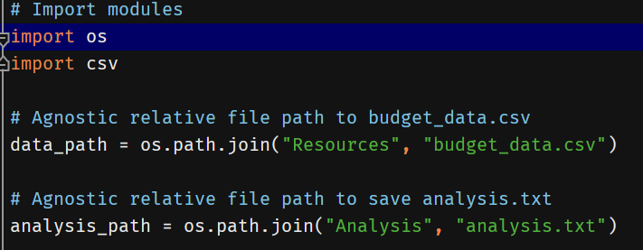
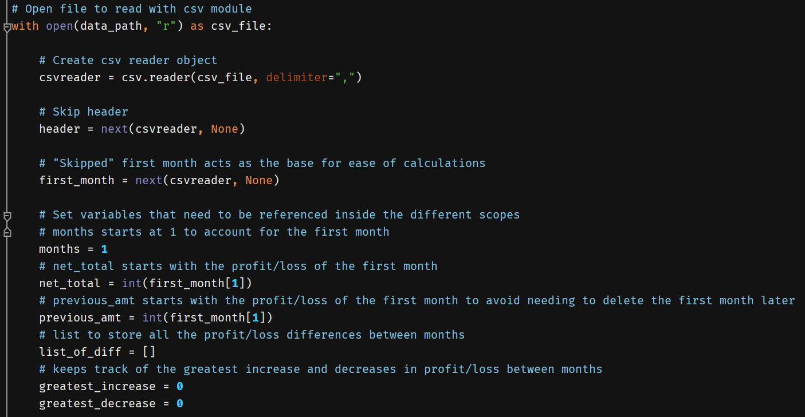
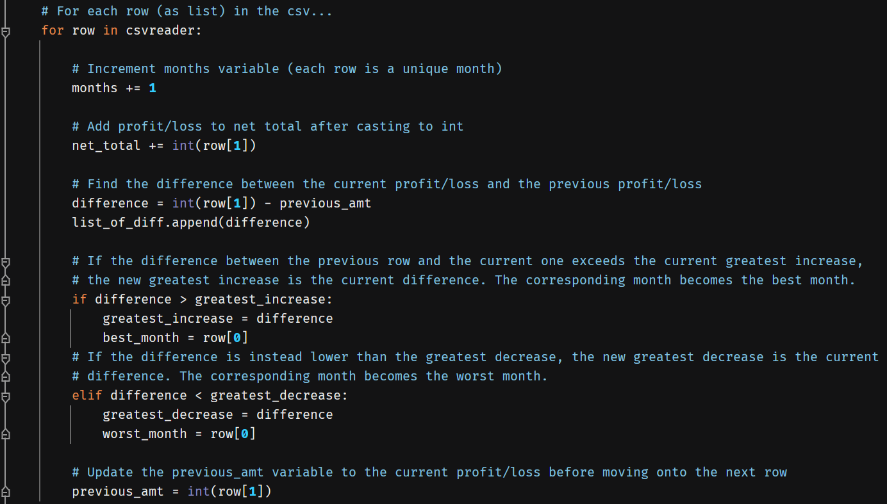

# Python-Challenge: Charles Phil Week 3 Homework

## PyBank: script explanation

### Imports and paths

To start the script, I import the os and csv modules and use the os module to construct the paths to the budget_data.csv
and analysis.txt files to use later in the script.

### Opening the file

I opened the file using the data_path variable on read mode and initialized the variables I would need to reference 
later when I loop through the csv. Using the csv module, I created the reader object and delimited the columns based
on the commas present in the csv. I then told the reader to read through the first row (i.e., the header) in order to 
begin the loop on the second row, which contains the actual data we want to look through.

### Looping through the file (REDO)

For each row in the csv (which then becomes a list containing the month-year and the profit/loss), I increment the
**months** variable by 1 as each row is a unique month. I add the net profit/loss to the net_total in order to get the 
final cumulative net total. 

When it came to finding the average change, there were several ways I thought about approaching the problem. Because we
are dealing with *net* totals, the only two values that matter are the initial and final values, which were 867884 and 
671099, respectively. There are 86 total months, but the initial month counts as the "base," meaning that there were
**85 months** after the initial months to account the changes for. This means that the average change would have been
about -2315.12 ((671099 - 867884) / 85). This means that starting from 867884, I would subtract 2315.12 85 times to
roughly end up at 671099.

I initially tackled the problem by using a readlines() method in order to get that first and last profit/loss value, but
I realized after finishing it that it seemed messy and inefficient to have two separate with-open statements running two
separate for loops running through the entire csv twice in order to get an answer for a single variable for the
analysis. I thought about reorganizing the code so that the entire analysis was done through the readlines() method, but
because we specifically learned how to use the csv module, I opted to instead try for a different approach for the 
average change in the with-open block using the csv reader instead.

To do this, I needed to keep track of each change *between* months, which I store in a variable called **difference**
and subsequently appened into a list called **list_of_diff**. In order to get the difference, I grab the current row's
profit/loss and subtract the previous amount (**previous_amt**) from it. Because the very first month does not have a
previous row to compare to (previous_amt starts at 0 to account for this) and must be omitted later when calculating the 
average, I need to remove the first value from the list of differences before calculating the average change, which I 
will do after the loop is finished.

By tracking the difference between the current row and the previous row for use in calculating the average change later,
I inadvertently also found an easy way to determine the greatest increase (**greatest_increase**) and the greatest
decrease (**greatest_decrease**). If the difference between the current row and the previous row is greater than the 