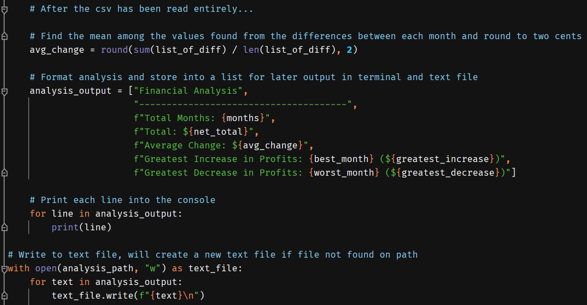
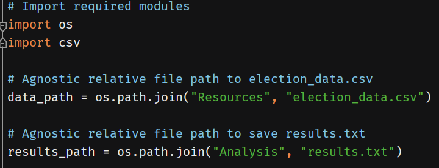
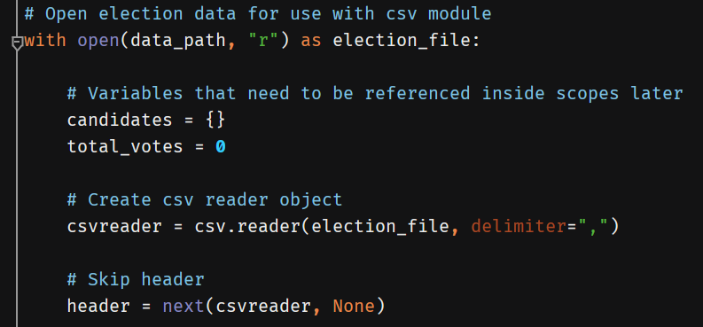
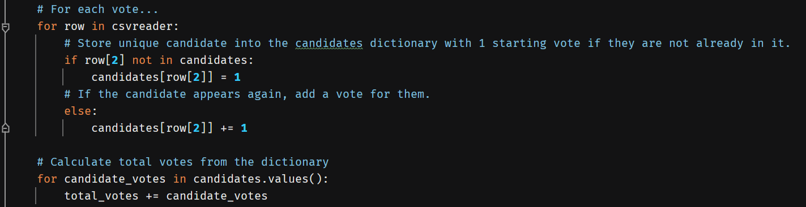
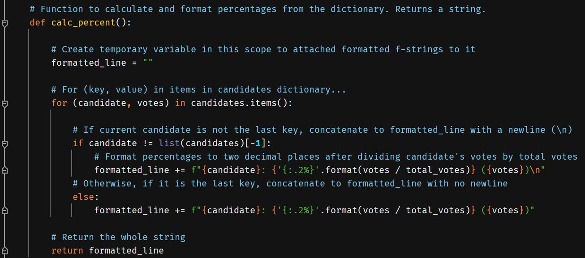
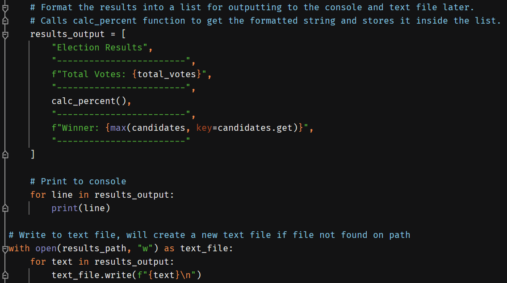

# Python-Challenge: Charles Phil Week 3 Homework

## PyBank: script explanation

### Imports and paths

To start the script, I import the os and csv modules and use the os module to construct the paths to the budget_data.csv
and analysis.txt files to use later in the script.

### Opening the file and determining initial variable values

I opened the file using the data_path variable on read mode and initialized the variables I would need to reference 
later when I loop through the csv. Using the csv module, I created the reader object and delimited the columns based
on the commas present in the csv. I then told the reader to read through the first row (i.e., the header) which skips 
ahead to the first row and contains the first month's values.

Because of how my loop is structured, I need to account for the fact that the first month is actually acting as the
**"base"** for my analysis. The average change, the greatest increase, and the greatest decrease all use the first
month as the *starting point*, meaning that it would make more sense to have those variables come as a result of 
calculating *from* the first month. As a result, I opted to have the reader read through this second row (i.e., the
second month) and store that first month's profit/loss into the **net_total** and **previous_amt**. The **previous_amt**
is especially important to do in this manner because we are primarily concerned with changes *between* months, as shown
later in my for loop. The **months** variable will therefore start at 1 to account for this first month. The 
**greatest_increase** and **greatest_decrease** variables start at 0 for now but will be updated to reflect the biggest
changes between months.

### Looping through the file

For each row in the csv (which then becomes a list containing the month-year and the profit/loss), I increment the
**months** variable by 1 as each row is a unique month. I add the row's net profit/loss to the net_total in order to get
the cumulative net total. 

When it came to finding the average change, there were several ways I thought about approaching the problem. Because we
are dealing with *net* totals, the only two values that matter are the initial and final values, which were 867884 and 
671099, respectively. There are 86 total months, but the initial month counts as the "base," meaning that there were
**85 months after the initial month** to account the changes for. Due to this, the average change would have been
about -2315.12 ((671099 - 867884) / 85). This means that starting from 867884, I would subtract 2315.12 85 times to
roughly end up at 671099.

I initially tackled the problem by using a readlines() method in order to get that first and last profit/loss value, but
I realized after finishing it that it seemed messy and inefficient to have two separate with-open statements running two
separate for loops running through the entire csv twice in order to get an answer for a single variable for the
analysis. I thought about reorganizing the code so that the entire analysis was done through the readlines() method, but
because we specifically learned how to use the csv module, I opted to instead try for a different approach for the 
average change in the with-open block using the csv reader instead.

To do this, I needed to keep track of each change *between* months, which I store in a variable called **difference**
and subsequently append into a list called **list_of_diff**. In order to get the difference, I grab the current row's
profit/loss and subtract the previous amount (**previous_amt**) from it. After the loop completes, I will use 
list_of_diff to calculate an alternative method of finding the average change.

By tracking the difference between the current row and the previous row for use in calculating the average change later,
I inadvertently found an easy way to determine the greatest increase (**greatest_increase**) and the greatest
decrease (**greatest_decrease**). If the difference between the current row and the previous row is greater than the
greatest increase up to that point, then the new greatest_increase is this current difference, and vice versa for the
greatest decrease. I then store that month into the **best_month** and **worst_month** variables to print and save
later on.

Lastly, I update the previous_amt to the current row's profit/loss before the loop executes again on the following row.

### After the loop: formatting, printing, and writing the analysis

Once the loop completes, I still need to find the average change to use later in the analysis. Using the list_of_diff
variable, I find the mean of all the differences. The reason why I do this is due to the fact that we are dealing with
**net** profit/loss values. If the sum of all net differences results in a negative number, then we know that we have
lost money over time, and vice versa. We know that we did indeed lose money between the first month and the last month,
so this is functionally equivalent. I then divide by the length of the list (the number of months after the first month)
and round to two decimals (because we are dealing with money).

Because we need to output the analysis to both the console *and* to a text file, I decided to arrange all the
formatting into one list and print/write each item in the list one line at a time in order to avoid having to rewrite
the analysis twice in its entirety. 

To write to a text file, I began a new with-open block in write mode. If the open function does not detect the name of 
the file at the path, it creates it by default. I did have to attach a newline (\n) to each line of text when writing to
the file in order to maintain the formatting.

## PyPoll: script explanation

### Imports and paths

Just like PyBank, I imported the os and csv modules for reading the csv files at the given paths.

### Opening the file and determining initial values

I wanted to approach this problem by pretending to be as blind to the data as possible. Although I knew from the 
instructions that there were only four candidates, I wanted to pretend that I didn't know how many candidates there were
(and to account for any possible write-ins). I decided that using a dictionary here would be the best, as the data
naturally lends itself to having a key-value pair (candidate-votes). By calling upon the name of the candidate directly,
we can then see the total number of votes that candidate received. Because of my intention of being as blind as possible
to the contents of the data, I decided to initialize an empty **candidates** dictionary along with a **total_votes** 
variable of 0 to add votes to later.

I then create the csv reader object and skip the header by calling the next function onto the reader.

### Looping through the file and tallying votes

Beginning with the first row (ballot), I wanted to know what the candidate's name was, which was stored in index
position 2 (since the row was transformed into a list). If I saw that the name was not a key in the dictionary, then I
created that key and started the value at 1, which makes that entry take on the candidate-votes structure I wanted. 

If I saw that the candidate's name is already a key in the **candidates** dictionary, then all I needed to do was to add
a vote for them in the dictionary.

While the first for loop went through all the ballots, the second for loop iterates through the dictionary values, and
adds them to the **total_votes** variable to obtain the sum of all the votes in the election.

### Using a function to format candidate-related items for the analysis

Due to being candidate-blind, I technically had no idea how many potential candidates there were, along with however
many votes they may have gotten. I wanted to keep the idea I had from the PyBank script where I stored each line of the
output as an item in a list that I could then iterate through to print out to the console and write to the text file.
However, as I was implementing that list, I realized that I had no idea how I could write each individual candidate's 
percentage of votes won if I didn't even know who they all were! I knew I had to go through each candidate in my
dictionary and then calculate their percentages and votes won, and I decided to have it so that all of their information
would be stored in one enormous f-string, with newlines (\n) between each candidate. This function accomplishes that 
for me and returns the f-string(s) with the added bonus of being able to not attach a newline to the last candidate in
the dictionary to avoid having a gap between the line being outputted following the candidates. The '{:.2%}'.format 
function takes the candidate's fraction of total votes and formats it as a percentage to two decimals to make it more
readable.

### Outputting to the console and text file

Using the same idea from PyBank, I created a list of items to be outputted to the console and the text file, with each
item representing a line. When it came time to writing the candidates' information, I called the function I made
(**calc_percent**) which generates the f-string for me.

To calculate the winner, I took the max function and called it on my dictionary of candidates, and had it only return
the *key* of the largest value. 